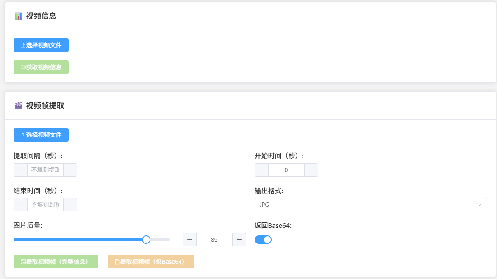
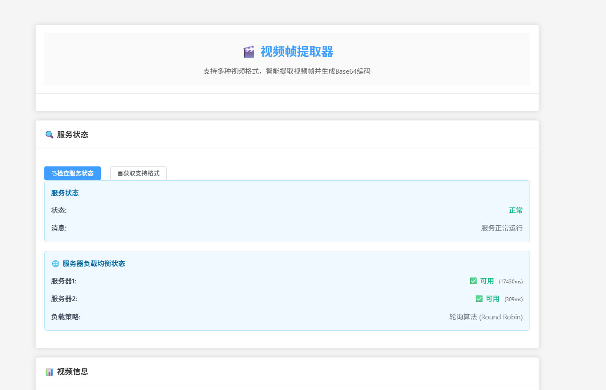
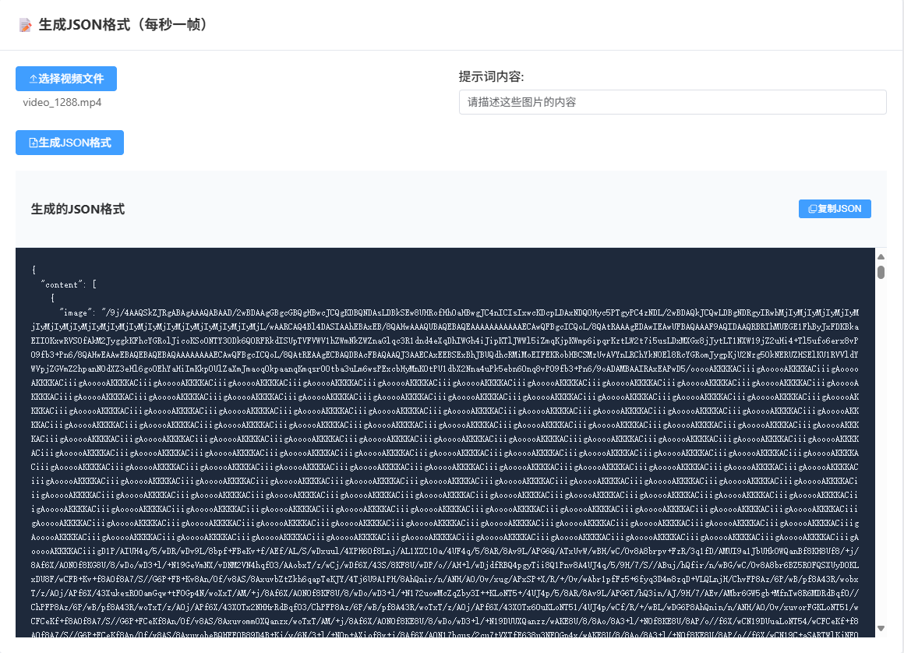

# 视频帧提取器 (Video Frame Extractor)

一个基于Spring Boot + Vue3的现代化视频帧提取工具，支持将不同格式的视频转换成对应帧率的图片，并输出每一帧图片的base64编码。

## 🌐 在线体验

**立即体验**: [http://159.75.236.29:5221/](http://159.75.236.29:5221/)

无需安装，直接在浏览器中体验完整功能！

## 📸 功能截图

### 视频信息获取


### 视频帧提取


### JSON格式生成


## 功能特性

### 🎬 视频处理能力
- 🎥 支持多种视频格式：MP4, AVI, MOV, MKV, WMV, FLV, WebM
- 🖼️ 提取视频帧并转换为图片（JPG, PNG, BMP等格式）
- 📊 获取视频详细信息（时长、帧率、分辨率等）
- ⏱️ 支持自定义时间范围提取
- 🔄 支持按间隔时间提取帧（如每5秒提取一帧）
- 📝 输出base64编码，便于前端显示
- 📋 生成特定JSON格式，支持AI训练数据集
- 💾 支持大文件处理（最大1GB）

### 🌐 现代化前端
- ✨ Vue3 + Element Plus 现代化界面
- 📱 响应式设计，完美适配移动端
- 🔄 实时进度显示和状态反馈
- 📋 一键复制Base64编码和JSON内容
- ⚠️ 智能大文件检测和处理提示
- 📝 详细操作日志记录

### 🚀 高可用架构
- 🌐 双服务器负载均衡
- 🛡️ 自动故障转移
- 📊 实时服务器状态监控
- ⚡ 智能服务器选择
- 🔧 完善的错误处理和重试机制

### 🛠️ 开发友好
- 🚀 RESTful API接口，易于集成
- 📖 详细的API文档
- 🔧 灵活的配置选项
- 🛡️ 完善的异常处理和参数验证

## 技术栈

### 🔧 后端技术
- **Java 17**
- **Spring Boot 3.2.0**
- **JavaCV 1.5.9** (FFmpeg Java绑定)
- **Maven** 构建工具

### 🎨 前端技术
- **Vue 3** - 渐进式JavaScript框架
- **Vite** - 下一代前端构建工具
- **Element Plus** - Vue 3 UI组件库
- **Axios** - HTTP客户端

### 🌐 部署架构
- **负载均衡** - 双服务器轮询
- **故障转移** - 自动服务器切换
- **大文件优化** - 5分钟超时 + 智能提示

## 快速开始

### 🌐 在线体验（推荐）

**无需安装，立即使用**：[http://159.75.236.29:5221/](http://159.75.236.29:5221/)

- ✅ 完整功能体验
- ✅ 双服务器负载均衡
- ✅ 大文件处理支持
- ✅ 现代化Vue3界面

### 💻 本地部署

#### 环境要求

**后端环境**:
- JDK 17 或更高版本
- Maven 3.6 或更高版本

**前端环境**:
- Node.js 16+ 
- npm 或 yarn

#### 后端部署

1. **克隆项目**
   ```bash
   git clone <repository-url>
   cd video-frame-extractor
   ```

2. **进入后端目录**
   ```bash
   cd Backend
   ```

3. **编译项目**
   ```bash
   mvn clean compile
   ```

4. **运行后端**
   ```bash
   mvn spring-boot:run
   ```
   
   后端将在 `http://localhost:8080` 启动

#### 前端部署

1. **进入前端目录**
   ```bash
   cd Vue3Front
   ```

2. **安装依赖**
   ```bash
   npm install
   ```

3. **启动开发服务器**
   ```bash
   npm run dev
   ```
   
   前端将在 `http://localhost:5221` 启动

4. **生产构建**
   ```bash
   npm run build
   ```
   
   构建文件将输出到 `dist` 目录

## 🎯 主要功能

### 1. 视频信息获取
获取视频文件的详细信息，包括时长、帧率、分辨率、文件大小等。

### 2. 视频帧提取（完整信息）
提取视频帧并返回详细信息，包括帧号、时间戳、尺寸和Base64编码。

### 3. 视频帧提取（仅Base64）
只返回Base64编码数组，适合需要简化数据的场景。

### 4. JSON格式生成
按每秒一帧提取视频，生成特定JSON格式，适合AI训练数据集：
```json
{
  "content": [
    {"type": "image", "image": "/9j/4AAQSkZJRgABAQAAAQABAAD..."},
    {"type": "image", "image": "/9j/4AAQSkZJRgABAQAAAQABAAD..."},
    {"type": "text", "text": "请描述这些图片的内容"}
  ]
}
```

### 5. 负载均衡和高可用
- 🌐 双服务器自动负载均衡
- 🛡️ 故障自动转移
- 📊 实时服务器状态监控
- ⚡ 智能服务器选择

### 6. 大文件处理优化
- 💾 支持最大1GB视频文件
- ⏱️ 5分钟处理超时
- ⚠️ 智能大文件检测和提示
- 🔄 处理进度实时反馈

## API 接口文档

### 1. 健康检查

**GET** `/api/video/health`

检查服务是否正常运行。

**响应示例：**
```json
{
  "status": "UP",
  "service": "Video Frame Extractor",
  "timestamp": 1703123456789
}
```

### 2. 获取支持的格式

**GET** `/api/video/supported-formats`

获取支持的视频和图片格式列表。

**响应示例：**
```json
{
  "success": true,
  "message": "获取支持格式成功",
  "data": {
    "videoFormats": ["mp4", "avi", "mov", "mkv", "wmv", "flv", "webm"],
    "imageFormats": ["jpg", "jpeg", "png", "bmp"]
  },
  "timestamp": 1703123456789
}
```

### 3. 获取视频信息

**POST** `/api/video/info`

上传视频文件并获取其基本信息。

**请求参数：**
- `file` (multipart/form-data): 视频文件

**响应示例：**
```json
{
  "success": true,
  "message": "获取视频信息成功",
  "data": {
    "fileName": "sample.mp4",
    "duration": 30000,
    "frameRate": 30.0,
    "width": 1920,
    "height": 1080,
    "fileSize": 5242880,
    "format": "mp4",
    "totalFrames": 900
  },
  "timestamp": 1703123456789
}
```

### 4. 提取视频帧

**POST** `/api/video/extract-frames`

提取视频帧并返回base64编码。

**请求参数：**
- `file` (multipart/form-data): 视频文件
- `intervalSeconds` (可选): 提取间隔秒数，如果不指定则提取所有帧
- `startTimeSeconds` (可选): 开始时间（秒），默认0
- `endTimeSeconds` (可选): 结束时间（秒），默认到视频结束
- `outputFormat` (可选): 输出图片格式，默认jpg
- `imageQuality` (可选): 图片质量1-100，默认85
- `returnBase64` (可选): 是否返回base64编码，默认true

**使用示例：**

1. **提取所有帧：**
   ```bash
   curl -X POST http://localhost:8080/api/video/extract-frames \
     -F "file=@sample.mp4"
   ```

2. **每5秒提取一帧：**
   ```bash
   curl -X POST http://localhost:8080/api/video/extract-frames \
     -F "file=@sample.mp4" \
     -F "intervalSeconds=5"
   ```

3. **提取指定时间范围的帧：**
   ```bash
   curl -X POST http://localhost:8080/api/video/extract-frames \
     -F "file=@sample.mp4" \
     -F "startTimeSeconds=10" \
     -F "endTimeSeconds=20" \
     -F "intervalSeconds=2"
   ```

**响应示例：**
```json
{
  "success": true,
  "message": "帧提取成功",
  "videoInfo": {
    "fileName": "sample.mp4",
    "duration": 30000,
    "frameRate": 30.0,
    "width": 1920,
    "height": 1080,
    "fileSize": 5242880,
    "format": "mp4",
    "totalFrames": 900
  },
  "frames": [
    {
      "frameNumber": 1,
      "timestampSeconds": 0.0,
      "base64Data": "/9j/4AAQSkZJRgABAQAAAQABAAD/2wBD...",
      "width": 1920,
      "height": 1080
    },
    {
      "frameNumber": 2,
      "timestampSeconds": 5.0,
      "base64Data": "/9j/4AAQSkZJRgABAQAAAQABAAD/2wBD...",
      "width": 1920,
      "height": 1080
    }
  ],
  "totalFramesExtracted": 2,
  "processingTimeMs": 1500
}
```

## 配置说明

应用配置文件 `Backend/src/main/resources/application.yml`：

```yaml
server:
  port: 8080  # 服务端口
  servlet:
    context-path: /api  # API基础路径

spring:
  servlet:
    multipart:
      max-file-size: 500MB  # 最大文件大小
      max-request-size: 500MB  # 最大请求大小

video:
  processor:
    temp-dir: ${java.io.tmpdir}/video-processor  # 临时文件目录
    max-duration: 3600  # 最大处理时长（秒）
    supported-formats: mp4,avi,mov,mkv,wmv,flv,webm  # 支持的格式
    output-format: jpg  # 默认输出格式
    image-quality: 85  # 默认图片质量
```

## 使用场景

1. **视频预览生成**：为视频生成预览图
2. **视频分析**：提取关键帧进行内容分析
3. **缩略图生成**：生成视频缩略图
4. **帧率转换**：按需提取特定帧率的图片
5. **视频处理流水线**：作为视频处理工作流的一部分

## 注意事项

1. **内存使用**：处理大视频文件时注意内存使用，建议设置合适的JVM堆内存
2. **临时文件**：应用会在临时目录创建文件，处理完成后会自动清理
3. **文件大小限制**：默认最大支持500MB的视频文件
4. **性能考虑**：提取所有帧可能耗时较长，建议根据需要设置合适的间隔

## 错误处理

应用提供了完善的错误处理机制：

- **参数验证错误**：返回400状态码和详细错误信息
- **文件格式不支持**：返回相应错误提示
- **文件大小超限**：返回413状态码
- **处理异常**：返回500状态码和错误详情

## 开发和扩展

### 项目结构

```
项目根目录/
├── Backend/                                     # 🔧 Spring Boot后端
│   ├── pom.xml                                 # Maven配置文件
│   ├── src/
│   │   ├── main/
│   │   │   ├── java/com/videoprocessor/
│   │   │   │   ├── VideoFrameExtractorApplication.java  # 主应用类
│   │   │   │   ├── controller/
│   │   │   │   │   └── VideoProcessorController.java    # REST控制器
│   │   │   │   ├── service/
│   │   │   │   │   └── VideoProcessorService.java       # 核心服务类
│   │   │   │   ├── model/
│   │   │   │   │   ├── VideoInfo.java                   # 视频信息模型
│   │   │   │   │   ├── FrameExtractionRequest.java      # 请求模型
│   │   │   │   │   └── FrameExtractionResponse.java     # 响应模型
│   │   │   │   └── config/
│   │   │   │       ├── WebConfig.java                   # Web配置
│   │   │   │       └── GlobalExceptionHandler.java     # 全局异常处理
│   │   │   └── resources/
│   │   │       └── application.yml                      # 应用配置
│   │   └── test/
│   │       └── java/com/videoprocessor/                 # 测试代码
│   └── target/                                 # Maven构建输出
├── Vue3Front/                                  # 🎨 Vue3现代前端
│   ├── src/
│   │   ├── App.vue                            # 主组件
│   │   ├── main.js                            # 入口文件
│   │   └── style.css                          # 样式文件
│   ├── dist/                                  # 构建输出
│   ├── package.json                           # 前端依赖配置
│   └── vite.config.js                         # Vite配置
├── Front/                                     # 📄 传统HTML前端
├── 文件资料/                                   # 📸 项目截图
├── README.md                                  # 📖 项目文档
└── 部署说明.md                                 # 🚀 部署指南
```

### 添加新功能

1. **支持新的视频格式**：在配置文件中添加格式支持
2. **添加图片处理功能**：扩展 `VideoProcessorService` 类
3. **添加新的API接口**：在 `VideoProcessorController` 中添加新方法
4. **自定义异常处理**：在 `GlobalExceptionHandler` 中添加处理逻辑

## 🚀 部署指南

### 生产环境部署

详细的部署文档：
- [宝塔面板部署教程](宝塔面板部署教程.md)
- [完整部署说明](部署说明.md)

### 性能建议

**服务器配置推荐**:

- **入门级**: 4核心 + 8GB内存 (支持10-20人同时使用)
- **标准级**: 8核心 + 16GB内存 (支持50-100人同时使用)
- **高性能**: 16核心 + 32GB内存 (支持200+人同时使用)

**JVM优化参数**:
```bash
# 标准配置
java -Xmx12g -Xms4g -XX:+UseG1GC -jar Backend/target/video-frame-extractor-1.0.0.jar

# 高性能配置
java -Xmx24g -Xms8g -XX:+UseG1GC -XX:MaxGCPauseMillis=100 -jar Backend/target/video-frame-extractor-1.0.0.jar
```

## 📊 性能指标

### 处理能力
- **小文件(<50MB)**: 20-30个并发
- **中等文件(50-200MB)**: 10-15个并发  
- **大文件(>200MB)**: 5-8个并发
- **最大文件支持**: 1GB

### 处理时间
- **50MB视频**: 30秒-1分钟
- **150MB视频**: 1-3分钟
- **500MB视频**: 3-8分钟

## 🔧 故障排查

### 常见问题

1. **处理超时**
   - 检查文件大小是否超过限制
   - 确认网络连接稳定
   - 查看服务器资源使用情况

2. **前端无法连接**
   - 检查后端服务是否启动
   - 确认端口是否开放
   - 查看CORS配置

3. **大文件处理失败**
   - 增加JVM内存配置
   - 检查磁盘空间
   - 设置合适的提取间隔

## 许可证

本项目采用 MIT 许可证。详见 LICENSE 文件。

## 贡献

欢迎提交 Issue 和 Pull Request 来改进这个项目！

### 开发贡献
- 🐛 Bug修复
- ✨ 新功能开发
- 📖 文档完善
- 🎨 UI/UX改进
- 🚀 性能优化

## 更新日志

### v2.0.0 (最新)
- ✨ 全新Vue3前端界面
- 🌐 双服务器负载均衡
- 💾 大文件处理优化
- 📋 JSON格式生成功能
- 📱 响应式设计支持
- 🔄 实时进度显示
- 📊 服务器状态监控

### v1.0.0
- 🎬 基础视频帧提取功能
- 📊 视频信息获取
- 🚀 RESTful API接口

---

**🌟 立即体验**: [http://159.75.236.29:5221/](http://159.75.236.29:5221/)

**享受现代化视频处理的乐趣！** 🎬✨